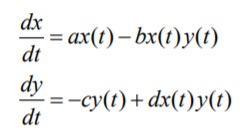
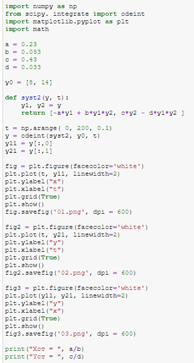

---
## Front matter
lang: ru-RU
title: Structural approach to the deep learning method
author: |
	Kuchenov I.V\inst{1,3}

## Formatting
toc: false
slide_level: 2
theme: metropolis
header-includes:
 - \metroset{progressbar=frametitle,sectionpage=progressbar,numbering=fraction}
 - '\makeatletter'
 - '\beamer@ignorenonframefalse'
 - '\makeatother'
aspectratio: 43
section-titles: true
---

# Модель хишников и жертв

## Постановка задачи

## Цель

Цель - Постройте график зависимости численности хищников от численности жертв.

### Теоретическая часть:

Простейшая модель взаимодействия двух видов типа «хищник — жертва» -
модель Лотки-Вольтерры. Данная двувидовая модель основывается на
следующих предположениях:
1. Численность популяции жертв x и хищников y зависят только от времени
(модель не учитывает пространственное распределение популяции на
занимаемой территории)
2. В отсутствии взаимодействия численность видов изменяется по модели
Мальтуса, при этом число жертв увеличивается, а число хищников падает
3. Естественная смертность жертвы и естественная рождаемость хищника
считаются несущественными
4. Эффект насыщения численности обеих популяций не учитывается
5. Скорость роста численности жертв уменьшается пропорционально
численности хищников

Уравнение второго порядка можно представить в виде системы двух
уравнений первого порядка:

В этой модели x – число жертв, y - число хищников. Коэффициент a
описывает скорость естественного прироста числа жертв в отсутствие хищников, с - естественное вымирание хищников, лишенных пищи в виде жертв. Вероятность взаимодействия жертвы и хищника считается пропорциональной как количеству жертв, так и числу самих хищников (xy). Каждый акт взаимодействия уменьшает популяцию жертв, но способствует увеличению популяции хищников (члены -bxy и dxy в правой части уравнения).

# Ход решения

Мои значения:

Код:

Построение графиков:
Графики:

Первый график:

Второй график:

Третий график:

# Выводы
Результат: Построили графики хищников и жертв и увидели как будет вести себя популяция на графиках.

Вывод: Построили математическую модель, использовали python, выявили результаты для трех случаев, научились строить математическую модель для нахождения исхода и результатов.
